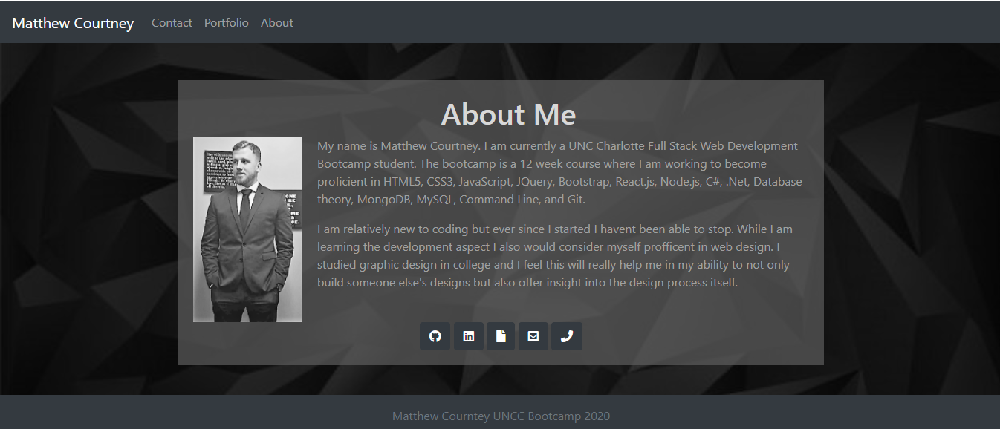

# responsive-portfolio-2

    This was my second homework project and the pace really did step up. This was by far the most challenging thing to get so far in the class.
    The idea was to create a portfolio page with working navigations and a responisve lay out. 

    while I was able to overcome alot of obstacles when coding the about me and the contact page, I really struggled getting the response I was looking for on 
    the portolio page. Obviously sa we move forward I hope to learn from my mistakes and find a solution to the probelm im having wit the help of my instructor.

